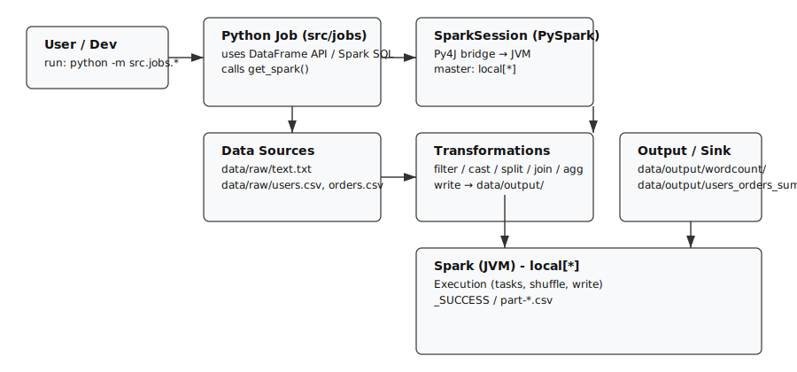

# pyspark-simple-learning (คำอธิบายภาษาไทย)

โปรเจกต์นี้เป็นตัวอย่าง PySpark ขนาดเล็กสำหรับฝึกการใช้งาน Spark บนเครื่อง (local mode)
โดยเน้นการอ่านข้อมูล (text/CSV) → แปลง/ทำความสะอาด → สรุปผล (group/join/agg) โดยใช้ DataFrame API และ Spark SQL

เป้าหมายของ README_th.md นี้คืออธิบายการติดตั้ง การรันทดสอบ การตรวจสอบผลลัพธ์ และการทำงานของระบบอย่างละเอียด พร้อม diagram เพื่อช่วยความเข้าใจ

----

## สารบัญ

- ข้อกำหนดพื้นฐาน
- โครงสร้างโปรเจกต์
- ติดตั้งและเริ่มต้นใช้งาน (step-by-step)
- รันทดสอบ (sanity checks) และรันเดโมทั้ง 3 สคริปต์ พร้อมผลลัพธ์ที่คาดหวัง
- ตรวจสอบผลลัพธ์จริง (checklist)
- ล้างผลลัพธ์และรันซ้ำ
- คำอธิบายการทำงานของระบบ (ระบบโดยรวม และ flow)
- Diagram (ไฟล์ SVG) และวิธีแปลงเป็น PNG
- Troubleshooting (ปัญหาพบบ่อย และแนวทางแก้ไข)
- แนวทางฝึกต่อ

----

## ข้อกำหนดพื้นฐาน

1) Python

- ใช้ Python 3.9+ (รองรับ 3.10/3.11)
- บริการคำสั่ง `python` หากไม่มีให้ใช้ `python3`

2) Java (จำเป็นสำหรับ Spark)

- PySpark ต้องใช้ Java เนื่องจาก Spark ทำงานบน JVM
- หากใช้ Java 11 ให้ใช้ PySpark 3.5.x (โปรเจกต์นี้ pin ไว้ใน requirements.txt เป็น `pyspark>=3.5.0,<4.0`)
- หากต้องการใช้ PySpark 4.x ให้ใช้ Java 17 และอัปเดต requirements

ตรวจสอบ Java:

```bash
java -version
```

ตัวอย่างการติดตั้ง (macOS / Homebrew):

```bash
brew install openjdk@11
# หรือ
brew install openjdk@17
```

ตั้ง JAVA_HOME (macOS ตัวอย่าง):

```bash
export JAVA_HOME=$(/usr/libexec/java_home -v 11)
# หรือ
export JAVA_HOME=$(/usr/libexec/java_home -v 17)
```

----

## โครงสร้างโปรเจกต์ (สำคัญ)

- src/
  - spark_session.py: ตัวช่วยสร้าง SparkSession สำหรับรันใน local
  - config.py: ค่าพื้นฐานและ path ของโปรเจกต์ (data/raw, data/output)
  - jobs/: สคริปต์ตัวอย่างที่รันได้ด้วย `python -m src.jobs.<module>`
- data/raw/: ข้อมูลตัวอย่าง
  - text.txt: ข้อความสำหรับ wordcount
  - users.csv, orders.csv: ตัวอย่างข้อมูลสำหรับ ETL/SQL
- data/output/: โฟลเดอร์ผลลัพธ์ที่สคริปต์เขียนออกมา

หมายเหตุ: เมื่อใช้ `df.write.csv("path")` Spark จะเขียนเป็นโฟลเดอร์ `path/` ที่มีไฟล์ `part-*.csv` และไฟล์ `_SUCCESS` เป็นตัวบอกว่าการเขียนสำเร็จ

----

## ติดตั้งและเริ่มต้นใช้งาน (step-by-step)

1. เปิดเทอร์มินัล และไปที่ root ของโปรเจกต์:

```bash
cd pyspark-simple-learning
```

2. สร้าง virtual environment และเปิดใช้งาน (แนะนำ):

```bash
python3 -m venv .venv
source .venv/bin/activate
```

(บน Windows ใช้ `python -m venv .venv` แล้ว `\.venv\Scripts\Activate.ps1` หรือ `\.venv\Scripts\activate`)

3. อัปเกรด pip และติดตั้ง dependencies:

```bash
pip install -U pip
pip install -r requirements.txt
```

4. ตรวจสอบว่าติดตั้งเรียบร้อย:

```bash
python -V
java -version
python -c "import pyspark; print('pyspark', pyspark.__version__)"
```

คาดหวังผล:
- Java เป็น 11 หรือ 17
- pyspark เป็น 3.5.x (ตามที่ pinned)

----

## รันทดสอบการติดตั้ง (Sanity check)

เช็คการสร้าง SparkSession แบบสั้นที่สุด:

```bash
python -c "from src.spark_session import get_spark; s=get_spark('smoke'); print(s.version); s.stop()"
```

หากคำสั่งข้างต้นแสดงเวอร์ชัน Spark โดยไม่มี error → สภาพแวดล้อมพร้อมสำหรับรันเดโม

----

## รันเดโมทั้ง 3 ตัว พร้อมคำอธิบายและผลลัพธ์ที่คาดหวัง

คำแนะนำทั่วไป: เปิด venv และรันคำสั่งจาก root ของโปรเจกต์

1) WordCount (DataFrame API)

รัน:
```bash
python -m src.jobs.wordcount
```

สิ่งที่จะทำ:
- อ่าน `data/raw/text.txt`
- แปลงข้อความเป็นตัวพิมพ์เล็ก
- แยกคำด้วย regex `\W+`
- explode ให้เป็นแถวละคำ
- groupBy คำนวณจำนวนคำ
- เขียนผลเป็น CSV ไปที่ `data/output/wordcount/`

ผลลัพธ์ที่คาดหวังบนหน้าจอ (ตัวอย่าง):
```
+----------+-----+
|word      |count|
+----------+-----+
|is        |4    |
|count     |3    |
|word      |3    |
|for       |2    |
|pyspark   |2    |
...       ...
+----------+-----+
```

ไฟล์ผลลัพธ์ที่ถูกสร้าง:
- data/output/wordcount/part-*.csv
- data/output/wordcount/_SUCCESS

เปิดดูไฟล์ตัวอย่าง (ใช้ Python / pandas):
```bash
python -c "import glob,pandas as pd; p=glob.glob('data/output/wordcount/part-*.csv')[0]; print(pd.read_csv(p).head(20))"
```

----

2) ETL: users + orders (join + aggregate)

รัน:
```bash
python -m src.jobs.etl_users_orders
```

สิ่งที่จะทำ:
- อ่าน `data/raw/users.csv` และ `data/raw/orders.csv` (header, inferSchema)
- ทำความสะอาด `orders`:
  - cast `amount` เป็น double (ไม่สามารถ cast เป็นตัวเลขจะกลายเป็น null)
  - parse `created_at` เป็น timestamp
  - กรองแถวที่ `amount` เป็น null ทิ้ง
- join กับ `users` ด้วย `user_id` (left join)
- groupBy เพื่อคำนวณ `order_count`, `total_amount`, `last_order_at`
- เขียนผลเป็น CSV ไปที่ `data/output/users_orders_summary/`

ผลลัพธ์ที่คาดหวังบนหน้าจอ (ตัวอย่าง):
```
+-------+----+----------+-----------+------------+-------------------+
|user_id|name|city      |order_count|total_amount|last_order_at      |
+-------+----+----------+-----------+------------+-------------------+
|4      |Mai |Phuket    |1          |999.9       |2025-10-05 08:30:00|
|2      |Aom |Chiang Mai|1          |250.0       |2025-12-01 09:00:00|
|1      |Boyd|Bangkok   |2          |159.5       |2025-12-23 18:45:10|
|3      |Ken |Khon Kaen |2          |105.74      |2025-11-12 12:00:00|
|5      |Nok |Bangkok   |1          |60.0        |2025-12-31 23:59:59|
+-------+----+----------+-----------+------------+-------------------+
```

ตรวจสอบไฟล์ผลลัพธ์:
```bash
python -c "import glob,pandas as pd; p=glob.glob('data/output/users_orders_summary/part-*.csv')[0]; print(pd.read_csv(p))"
```

----

3) Spark SQL demo (temp view + SQL)

รัน:
```bash
python -m src.jobs.sql_demo
```

สิ่งที่จะทำ:
- อ่าน `users.csv` และ `orders.csv`
- สร้าง temp view ชื่อ `users` และ `orders`
- ใช้ `spark.sql(...)` เขียน SQL ที่ JOIN + GROUP BY + ORDER BY

ผลลัพธ์ที่คาดหวังบนหน้าจอ (ตัวอย่าง):
```
+-------+----+----------+-----------+------------+
|user_id|name|city      |order_count|total_amount|
+-------+----+----------+-----------+------------+
|4      |Mai |Phuket    |1          |999.9       |
|2      |Aom |Chiang Mai|2          |250.0       |
|1      |Boyd|Bangkok   |2          |159.5       |
|3      |Ken |Khon Kaen |2          |105.74      |
|5      |Nok |Bangkok   |1          |60.0        |
+-------+----+----------+-----------+------------+
```

หมายเหตุ: SQL demo นับ `COUNT(DISTINCT o.order_id)` และอาจได้ผลต่างกับ ETL demo ในกรณีที่มีแถว `amount` เป็น `N/A` เนื่องจาก ETL demo ลบทิ้งแถวที่ cast ไม่ได้ก่อน

----

## การรันทดสอบแบบตรวจผลลัพธ์จริง (Checklist)

หลังรันเดโม ให้ตรวจว่ามีไฟล์ผลลัพธ์ถูกสร้างขึ้นจริง:

```bash
python -c "import glob; assert glob.glob('data/output/wordcount/part-*.csv'), 'wordcount output missing'; assert glob.glob('data/output/users_orders_summary/part-*.csv'), 'users_orders_summary output missing'; print('OK: outputs exist')"
```

คำสั่งล้างผลลัพธ์ (ถ้าต้องการรันใหม่ทั้งหมด):

```bash
rm -rf data/output/wordcount data/output/users_orders_summary
```

----

## การทำงานของระบบ (System design & flow)

ภาพรวม flow เมื่อรันสคริปต์ใน `src/jobs/`:

1. สคริปต์ Python (`src/jobs/..`) สร้างหรือเรียก `SparkSession` ผ่าน `src.spark_session.get_spark(...)` ซึ่งเป็น entry point ของ Spark
2. `SparkSession` สื่อสารกับ JVM (Spark) ผ่าน Py4J และสร้าง SparkContext ที่เป็นตัวจัดการ cluster (ในกรณีนี้คือ local)
3. Spark อ่านข้อมูลจาก `data/raw/` (text/csv) เป็น DataFrame โดยใช้ DataSource API
4. ทำ transformation ต่าง ๆ (withColumn, cast, filter, split, explode, groupBy, join)
5. เมื่อเรียก `df.write...` Spark จะรวบรวมผล (shuffle/aggregation) และเขียนไฟล์ผลลัพธ์ไปที่ `data/output/` เป็นชุดของไฟล์ `part-*.csv`
6. สคริปต์ปิด `SparkSession` (s.stop()) เมื่อเสร็จงาน

ประเด็นสำคัญ:
- การรันแบบ local จะใช้ `master("local[*]")` และมีการตั้งลด `spark.sql.shuffle.partitions` ให้เหมาะสมกับเครื่องเล็ก
- การตั้ง `spark.driver.bindAddress` และ `spark.driver.host` เป็น `127.0.0.1` เพื่อหลีกเลี่ยงปัญหา UnresolvedAddress บนบางเครื่อง
- เวลาแปลง timestamp ควรระวัง timezone — โปรเจกต์ตั้ง timezone เป็น UTC เพื่อคงที่ของการแปลงเวลา

----

## Diagram (ไฟล์ SVG อยู่ที่ `assets/architecture_diagram.svg`)

ไฟล์ diagram อธิบายส่วนประกอบและการไหลของข้อมูล (local execution):



หากต้องการแปลงเป็น PNG (บนเครื่องที่มี ImageMagick หรือ rsvg-convert):

- ImageMagick (convert):
```bash
convert assets/architecture_diagram.svg assets/architecture_diagram.png
```
- rsvg-convert:
```bash
rsvg-convert -f png -o assets/architecture_diagram.png assets/architecture_diagram.svg
```

----

## Troubleshooting (ปัญหาที่พบบ่อยและการแก้ไข)

1) ModuleNotFoundError: No module named 'pyspark'
- สาเหตุ: ยังไม่ได้ติดตั้ง dependency หรือยังไม่ได้เปิด venv
- แก้ไข:
  - source .venv/bin/activate
  - pip install -r requirements.txt

2) JAVA_GATEWAY_EXITED / UnsupportedClassVersionError
- สาเหตุ: เวอร์ชัน Java ไม่ตรงกับ PySpark (เช่น Java ต่ำกว่าเวอร์ชันที่ PySpark ต้องการ)
- แนวทาง:
  - ถ้าใช้ Java 11 ให้ใช้ PySpark 3.5.x
  - ถ้าต้องการใช้ PySpark 4.x ให้ติดตั้ง Java 17 และอัปเดต dependencies

3) UnresolvedAddressException ตอนเริ่ม Spark
- สาเหตุ: hostname/bind address มีปัญหา
- แนวทาง:
  - ตรวจสอบ `src/spark_session.py` ว่าได้ตั้ง `spark.driver.bindAddress` และ `spark.driver.host` เป็น `127.0.0.1`

----

## แนวทางฝึกต่อ (ไอเดีย)

- เพิ่มคอลัมน์ใหม่ด้วย `withColumn` เช่น bucketing ยอดเงิน
- ทดลอง filter/where เฉพาะเมืองที่สนใจ
- เพิ่ม `avg(amount)`, `min`, `max` ใน aggregation
- เปรียบเทียบ join แบบ inner/left
- เปลี่ยน output เป็น Parquet แล้วอ่านกลับด้วย `spark.read.parquet`
- แยก logic เป็นฟังก์ชันย่อยและเขียน assert ตรวจผลลัพธ์

----

หากต้องการให้ผม commit README_th.md และ diagram เป็น PNG ด้วย ผมสามารถแปลง SVG เป็น PNG แล้ว commitไฟล์ PNG ให้ได้ (ต้องการอนุญาตให้ผมทำ commit เพิ่มเติมหรือไม่)